contact-form-app
================

Java Contact form REST API runs on Spring Framework, JUnit, Maven, Hibernate and MySQL.

Setup
-----

#### Databases and tables
Create MySQL databases and tables, start server instance http://dev.mysql.com/downloads/workbench/

#### Build with Maven and run local Jetty web server
Project runs on Apache Maven http://maven.apache.org/

To start local server, type `mvn compile package jetty:run` and navigate to http://localhost:8080

#### Unit tests
Type `mvn tests` to run unit tests

Wireframes
----------

***Contact Form App***
**Home Page**
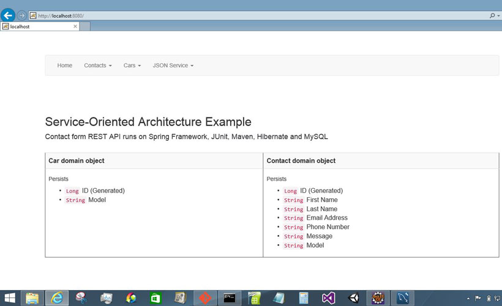

**Add New Car**
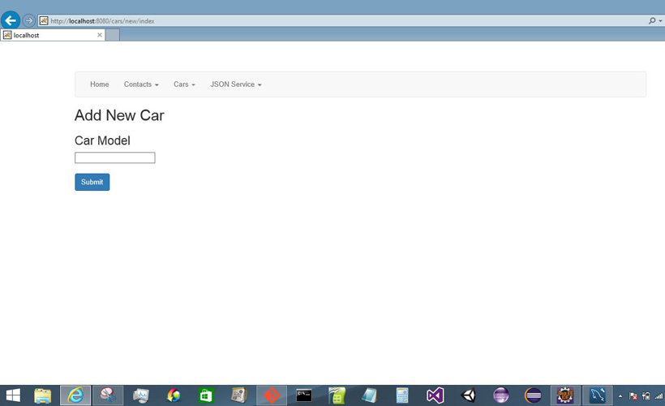

**Add New Car Confirmation**
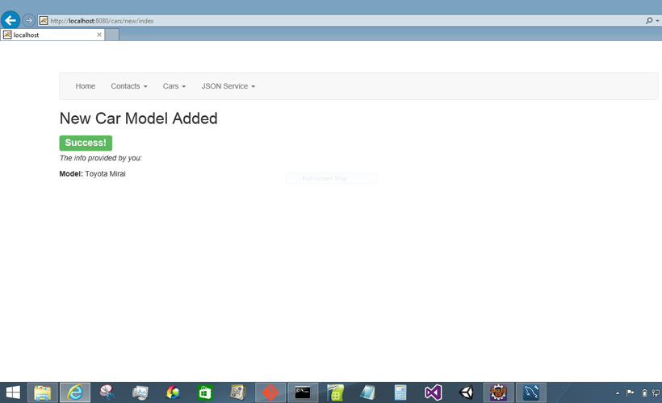

**Add New Contact**
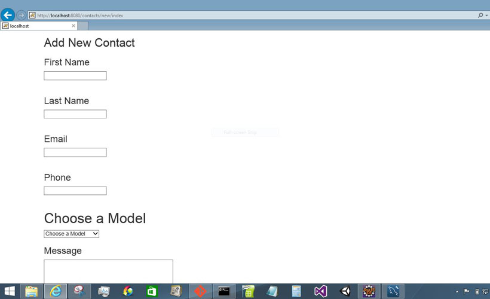

**Add New Contact Confirmation**
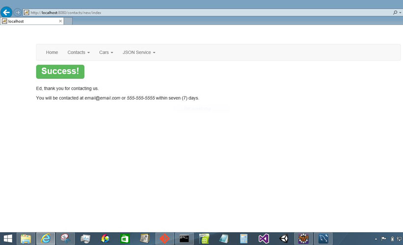

**Car Detail**
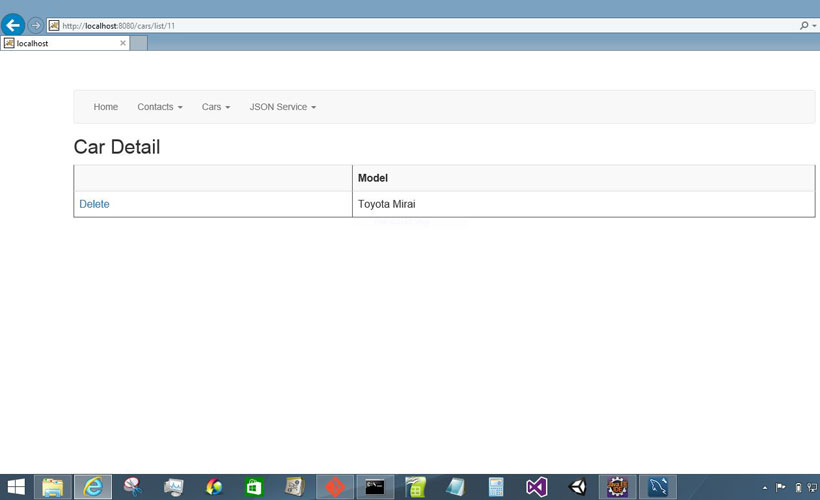

**Delete Car Confirmation**
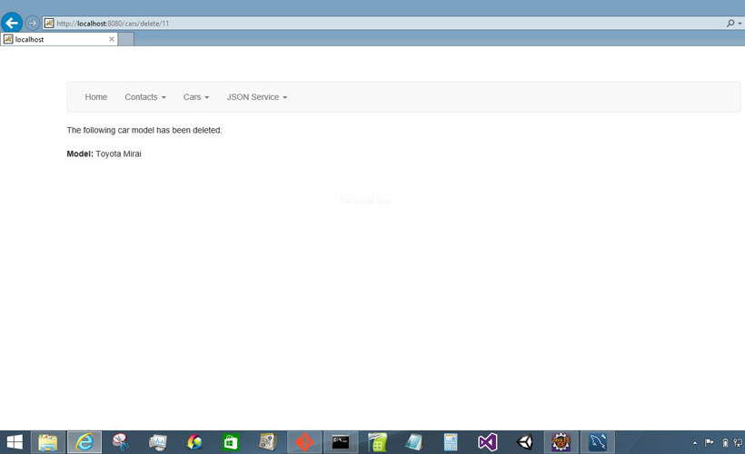

**Contact Detail**
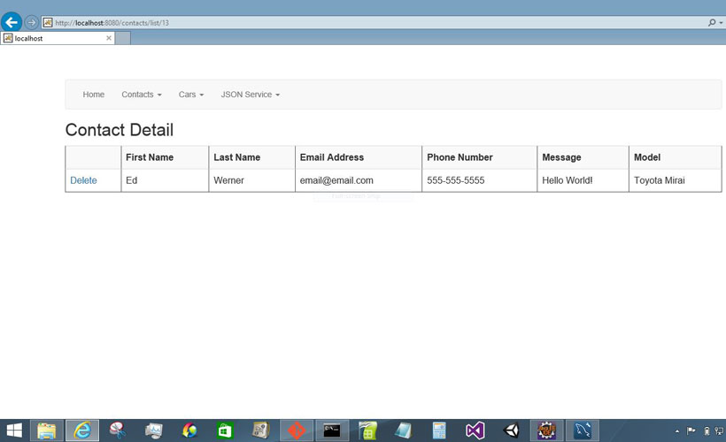

**Delete Contact Confirmation**
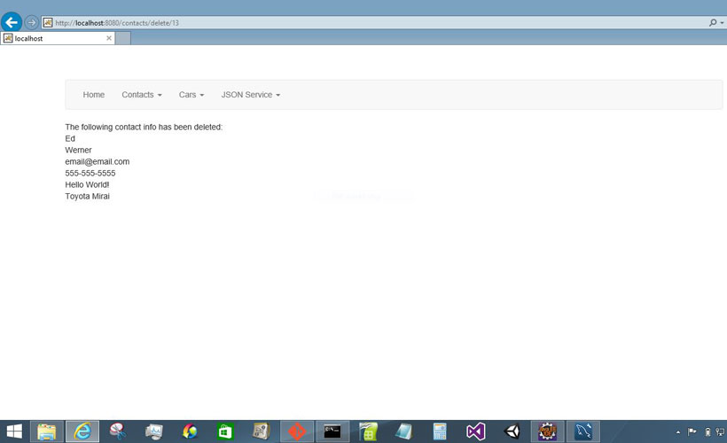

**Cars JSON**
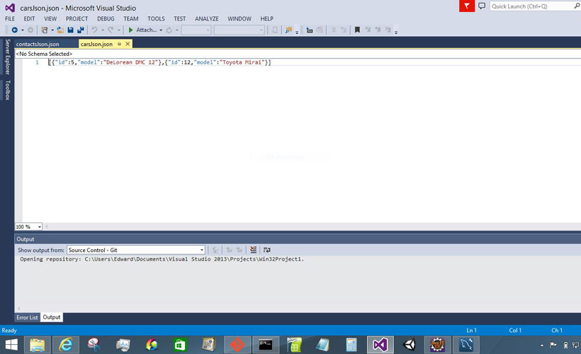

**Contacts JSON**
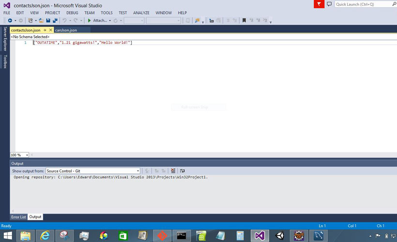

**List of Cars**
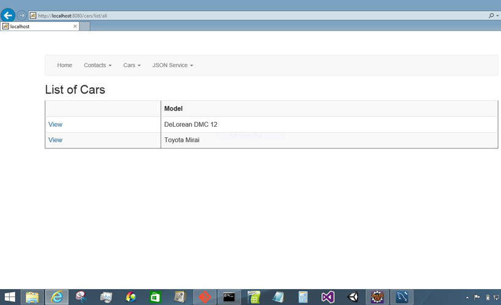

**List of Contacts**
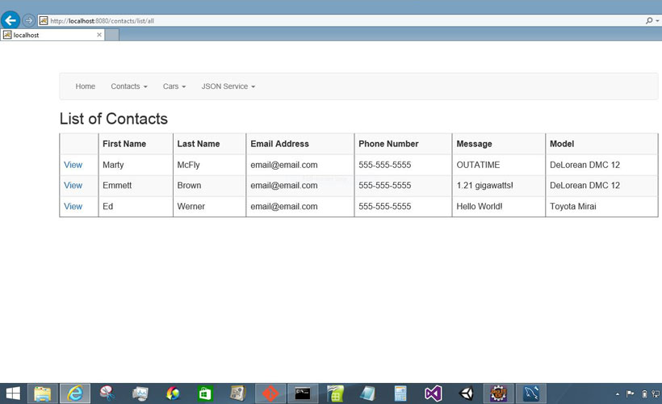
